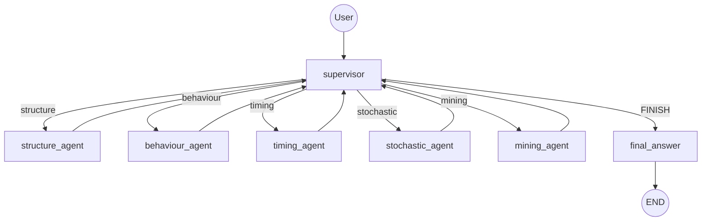

# Orchestrazione multi-agente (LangGraph)

Il modulo `petrinet_lab.agent.multiagent` implementa il pattern
**supervisor + specialisti** con `StateGraph`:



(Il diagramma si rigenera con `python -m petrinet_lab.agent.multiagent --topology`.)

## Specialisti e tool

| Agente | Tool | Output tipico |
|---|---|---|
| `structure_agent` | `list_models`, `describe_model`, `structural_analysis` | posti/transizioni, invarianti P/T, conservative |
| `behaviour_agent` | `reachability_analysis` | stati, boundedness, deadlock, liveness |
| `timing_agent` | `temporal_analysis`, `timed_simulation` | classi di stato, finestre di firing, time-lock |
| `stochastic_agent` | `stochastic_analysis` | stazionaria, throughput, sojourn time |
| `mining_agent` | `simulate_model` | tracce, varianti, conteggi attività |

Il **supervisor** legge domanda + riassunti e risponde con due righe:

```text
AGENT: stochastic_agent
TASK: What is the stationary probability that the machine is down?
```

La **decomposizione in task focalizzati** è ciò che evita che uno specialista
risponda fuori scope su domande composite. `parse_decision` estrae le due righe;
se il modello risponde con una sola parola si ricade su `parse_route` (primo
token riconosciuto), quindi l'orchestrazione funziona anche con LLM piccoli.
Il nodo `final_answer` sintetizza i risultati con numeri concreti. `max_rounds`
(default 8) limita il ciclo; il `recursion_limit` del grafo è 60.

Verifica end-to-end con **Ollama locale** (`qwen3:30b-a3b-instruct`):
deadlock di `parallel_workflow` corretto (1 marcatura) e stazionaria della
`machine` corretta (P(down)=0.25), sintesi finale coerente. Il modello 4b
funziona per domande singole ma è meno affidabile nella sintesi.

## Uso

```bash
# Locale (Ollama o LM Studio, auto-detect su 11434/1234)
export AGENT_PROVIDER=local
export LOCAL_MODEL=qwen3:30b-a3b-instruct-2507-q8_0   # consigliato per l'orchestrazione
# export LOCAL_MODEL=qwen3:4b-instruct-2507-q4_K_M    # più veloce, ideale per test singoli
python -m petrinet_lab.agent.multiagent \
  "Is parallel_workflow bounded? Any deadlock? Stationary probability the machine is down?"

# Cloud
export GOOGLE_API_KEY=...
python -m petrinet_lab.agent.multiagent "..." --topology   # solo topologia, senza LLM

# Demo completa
python examples/06_multiagent_demo.py
```

## LLM locali

`agent.agent._build_llm` supporta i provider `local`, `lmstudio`, `ollama`:

- endpoint OpenAI-compatibili (LM Studio `http://localhost:1234/v1`,
  Ollama `http://localhost:11434/v1`), configurabili con `LOCAL_BASE_URL`;
- `LOCAL_MODEL` per fissare il modello, altrimenti il primo modello
  "instruct" disponibile viene scelto automaticamente interrogando `/v1/models`;
- auto-detect via socket se non ci sono API key cloud: se la porta 11434 o
  1234 risponde, il provider locale viene usato automaticamente.

## Roadmap / memoria di progetto

Fatto: supporto **LLM locali** (auto-detect + tool calling) e **decomposizione
del task** da parte del supervisor, validati end-to-end con Ollama/qwen3.

Idee da riprendere in sessioni future (segnate qui per non perderle):

- [ ] **Checkpointer LangGraph** (`MemorySaver`/SQLite) per conversazioni
      multi-turno e ripresa del grafo dopo un errore.
- [ ] **Human-in-the-loop** con `interrupt()` sul nodo supervisor per approvare
      analisi costose (reachability su reti grandi).
- [ ] **Provider DeepSeek** via endpoint OpenAI-compatibile
      (`base_url="https://api.deepseek.com"`), utile per tool calling economico.
- [ ] **Valutazione dell'orchestrazione**: harness che misura routing corretto,
      numero di round e accuratezza numerica per provider/modello (locale vs
      cloud), con prompt di difficoltà crescente.
- [ ] **Specialista process mining "vero"**: tool che accetta un event log XES
      caricato dall'utente (oggi `mining_agent` simula dal modello).
- [ ] **Esporre il multi-agente nella dashboard Streamlit** (tab Agent con
      visualizzazione del percorso supervisor → specialisti).
